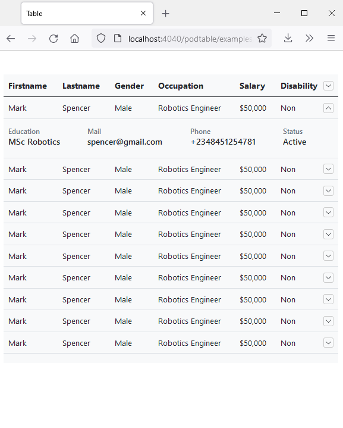

<p align="center"></p>

<p align="center">
    <a href="https://github.com/inlogicstudio/podtable">
        
    </a>
    <a href="https://www.npmjs.com/package/podtable">
        
    </a>
    <a href="https://www.npmjs.com/package/podtable">
        
    </a>
</p>


Podtable is a no dependency table library to fit large table dataset into smaller device screens base on the maximum squishability with various options on achieving a responsive datatable.

- [**Preview**](#preview)
- [**Installation**](#installation)
- [**Usage**](#usage)
- [**Config**](#config-options)
- [**Methods**](#instance-methods)
- [**Contributing**](#contributing)
- [**Examples**](#examples)
- [**Roadmap**](#roadmap)


## Preview

<p align="center">
    
</p>

## Installation

##### NPM

`npm install podtable`

##### CDN
`https://unpkg.com/podtable@<VERSION>/dist/podtable.css`
`https://unpkg.com/podtable@<VERSION>/dist/podtable.js`


## Usage

Include podtable script

```html
<script src="path/to/podtable.js></script>
```

Include podtable styles

```html
<link rel="stylesheet" type="text/css" href="path/to/podtable.css" />
```

Or import podtable using the ES6 syntax

```js
import Podtable from  "podtable"
```

```css
@import "~podtable/dist/podtable.css"
```

#### Quick Note :

* Podtable will use the last cell of every row including the head as control column.

* Or you can define an empty cell for podtable to use as control column.

* Its really important to include the podtable stylesheet because podtable relies on it.

* Also podtable css doesn't include general table styling only css which it needs so you can style your table as you want.

* if you are using vuejs always provide a [Unique key for your v-for](https://stackoverflow.com/questions/56726147/why-does-vue-use-its-in-place-patch-though-im-binding-a-key-in-v-for-loop) because of vue's [In-place-patch](https://v3.vuejs.org/guide/list.html#maintaining-state) strategy.


Your HTML structure
```html

<table id="table" class="table" width="100%">
    <thead>
        <tr>
            <th>Firstname</th>
            <th>Lastname</th>
            ...
            <th></th>
        </tr>
    </thead>
    <tbody>
        <tr>
            <td>Mark</td>
            <td>Spencer</td>
            ...
            <td></td>
        </tr>
    </tbody>
</table>

```

Then initialize podtable by passing the table selector

```js
new Podtable('#table', {
    // config options
})
```
Or passing the element directly

```js
new Podtable(document.querySelector('#table'), {
    // config options
})
```

The podtable instance receives two params the first parameter is an element selector or a table element and also the second parameter is a config object which receives a key value pairs in achieving a responsive table which can be use together or as your use case demands.

## Config Options

* `KeepCell`
* `priority`
* `method`
* `rowGroup`

#### `keepCell`

which is an array of cells index that wont be hidden.
Also note the first cell for the table rows with an index of `0` will not be hidden by default.

```js
new Podtable('#table', {
    keepCell: [1, 6],
});
```

#### `priority`

This config option which is an array of index of cells, which determines how cells will be hidden and if only few cell index are passed to the priority config object this will take precedence over the other cell index.

```js
new Podtable('#table', {
    priority: [2, 4, 5]
})
```
####  `method`

This config option option which takes in a function to be executed for the hidden cells. and the function receives a parameter to acess the index of the cell that was last hidden.

```js
new Podtable('#table', {
    method: (state) => {
        if(state.current == 5) {
            // do something
        }
    }
});
```

#### `rowGroup`

This config option which takes in a boolean in order to use the row group feature, so for this to work 

* Data Iteration needs to be done via the body tag that is rows should be grouped together via the body tag

* podtable assumes every first row of each body tag is the row group header hence there is need to let podtable know it should ignore it using a dataset `data-ptr-ignore`

* Content in your ignored rows should be wrapable and should not have a fixed width

* Your ignored row td cells should have colspan that will correspond to the number of cells in other rows.

```js
new Podtable('#table', {
    rowGroup: true
});
```

```html
<table id="table" class="table" width="100%">
    <thead>
        <tr>
            <th>Firstname</th>
            <th>Lastname</th>
            <th></th>
        </tr>
    </thead>
    <tbody>
        <tr data-ptr-ignore="">
            <td colspan="3"></td>
        </tr>
        <tr>
            <td>Mark</td>
            <td>Spencer</td>
            <td></td>
        </tr>
    </tbody>
    ...
    <!-- more body tags here grouping rows together -->
</table>
```

In fact for every row group you can define an extra row in order to show empty row group message.

```html
<table id="table" class="table" width="100%">
    <thead>
        <tr>
            <th>Firstname</th>
            <th>Lastname</th>
            ...
            <th></th>
        </tr>
    </thead>
    <tbody>
        <tr data-ptr-ignore="">
            <td colspan="3">This is the Heading</td>
        </tr>

        <!-- other rows if there is data to show -->

        <tr data-ptr-ignore="">
            <td colspan="3">
                Sorry no record to show
            </td>
        </tr>
    </tbody>
</table>
```

## Instance methods
* `destroy()`


#### `destroy()`

The destroy method revert any alteration to the table in the DOM and detach all event listeners.

```js
const podtable = new Podtable('#table', { 
    // config 
});

podtable.destroy()
```

## Contributing

Thank you for considering to contribute to Podtablejs, pull requests, is highly recommended not just bug reports.


## Examples
you can view it live on codepen

* V1.1.4 [https://codepen.io/inlogicstudio/pen/wvqLEXP](https://codepen.io/inlogicstudio/pen/wvqLEXP) 

## Roadmap
* Custom control toggle to show hidden cells in child row.
* controls toggle in footer thoughts on what to do about it.
* More awesomeness in achieving a responsive datatable. &#128522;

## License

Podtablejs is an open-sourced software licensed under the [MIT license](LICENSE.md).